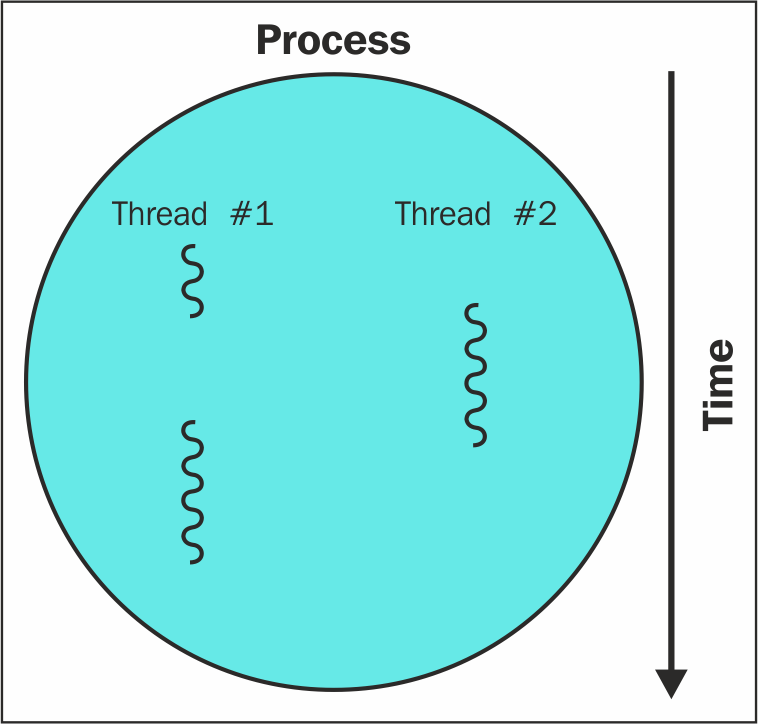

# Threads - Week 12, Day 1

_When computers were first hitting the mainstream, multitasking was something of a luxury. Eventually, computers were able to simulate simultaneous tasks by utilizing process interrupts. Systems were sturdy enough that app-switching felt natural and smooth. In computing terms, this is known as contex switching._

_Developers soon realized that some processes can be more effectively handled if they were composed of multiple lightweight processes that simply shared resources. These lightweight processes are whats known as threads._

## Thread of Execution

A thread is what's known as a _thread of execution_. It's the smallest set of instructions that can resolve. They can indeed be thought of as a _lightweight task_. Threads execute in something known as a _process_. A process is what you would consider a computer application or program.
<br></br>

> _Here we see a diagram of threads in a process. The vertical axis describes the amount of time it takes for them to complete._

## Synchronization

What is _synchronization_? Synchronization is the tool we utilize to avoid thread interference and memory consistency errors.

- _This is synchronization as in "working together", not necessarily occurring at once and in the same way.[<sup>1</sup>](#ereferences)_


- One thing to note is that synchronization can also cause thread contention. This is when two or more threads try to access the same resource simultaneously. Note the blocking code example below.


- A simple solution is to invoke the `Thread` method `.join()`. This method will put the calling thread into a waiting state. It will remain in said state until the referenced thread terminates. This allows for inter-thread synchronization.


- `.join()` creates a _happens-before_ relationship. All actions in the thread _happen-before_ any other thread successfully returns from a `.join()` on that thread.

## Deadlock and Blocking Code

- Blocking code is any code that prevents further code from executing.


- Threads can execute blocking code indefinitely, causing what's known as a _deadlock_.


- Deadlocked code will typically result from variables utilized between multiple thread; if states are in the process of being changed, then neither thread will resolve.[<sup>2</sup>](#references) Observe the following code:

    ```java
    public class Deadlock {
        static class Friend {
            private final String name;
    
            public String getName() {
                return name;
            }
    
            public Friend(String name) {
                this.name = name;
            }
    
            public synchronized void bow(Friend bower) {
                System.out.format("%s: %s has bowed to me! %n",
                        this.name, bower.getName());
                bower.bowBack(this);
            }
    
            public synchronized void bowBack(Friend bower) {
                System.out.format("%s: %s has bowed back to me! %n",
                        this.name, bower.getName());
            }
        }
    
        public static void main(String[] args) {
            final Friend alphonse = new Friend("Alphonse");
            final Friend gaston = new Friend("Gaston");
    
            new Thread(() -> alphonse.bow(gaston)).start();
            new Thread(() -> gaston.bow(alphonse)).start();
        }
    }
    ```

  Both Alphonse and Gaston are forever in a state of invoking `bow()` and can never resolve that method. Why? `bow()` is invoking `bowBack()` which accepts the other bower object as an argument. The problem is that the other bower object is also in their `bow()` method and is also anticipating a bower. Neither bower can be accepted into the method due to how threads with synchronized codes work. Thus, this code is deadlocked and will run indefinitely.
  <br></br>


> _The ever courteous Alphonse and Gaston humorously deadlocked._

## Executors

_Executors_ refer to objects that _encapsulate_ functionality related to thread management and creation.[<sup>3<sup>](#references) They decouple writing executable code with the threads they execute in. The Java API provides a _functional interface_ with a passable  `Runnable` object:

```java
 Executor executor = anExecutor;
 executor.execute(new RunnableTask1());
 executor.execute(new RunnableTask2());
 ```

The Java API provides another Executor interface called _ExecutorService_. This is an extension of the original interface that provides more discrete methods and handle its own termination.[<sup>4</sup>](#references)

```java
 void shutdownAndAwaitTermination(ExecutorService pool) {
   pool.shutdown(); // Disable new tasks from being submitted
   try {
     // Wait a while for existing tasks to terminate
     if (!pool.awaitTermination(60, TimeUnit.SECONDS)) {
       pool.shutdownNow(); // Cancel currently executing tasks
       // Wait a while for tasks to respond to being cancelled
       if (!pool.awaitTermination(60, TimeUnit.SECONDS))
           System.err.println("Pool did not terminate");
     }
   } catch (InterruptedException ie) {
     // (Re-)Cancel if current thread also interrupted
     pool.shutdownNow();
     // Preserve interrupt status
     Thread.currentThread().interrupt();
   }
 }
```
## Thread Pool

>Most of the executor implementations in `java.util.concurrent` use thread pools, which consist of _worker threads_. This kind of thread exists separately from the Runnable and Callable tasks it executes and is often used to execute multiple tasks.[<sup>5<sup>](https://docs.oracle.com/javase/tutorial/essential/concurrency/pools.html)

Thread Pools are composed of worker threads. These threads exists seperate from `Runnable` created threads. Worker threads can be created all at once and accept any meaningful work from an `Executor`. This minimizes the overhead created from thread creation.[<sup>6</sup>](#references)

## Notes

- Don't think too hard about this stuff. A lot of this material will be abstracted from you once we start utilizing _Spring_ and _Spring Boot_.


- You should understand what constitutes a thread, what constitutes a process, and how these are handled by a computer system.


- Just like with deadlocks, threads can experience a _livelock_. This describes when a thread's action is in response to a thread's action and so on, causing threads to stop progress from being too "busy" responding to one another.


- Threads can also experience _starvation_ which describes when a thread cannot accesss its shared resources, halting progress.


- In addition to `Runnable` there is also `Callable`. This interface defines `call()` method that returns a value.


- _Multi-threaded_ refers to a form of parallelization for simultaneous processing. Processors are composed of multiple CPU cores. Work can be divided up between these cores and processed in parallel, thus saving time.


- _Hyper-threaded_ refers to a CPU core that can run multiple threads in parallel. It's a proprietary Intel technology. Intel is moving away from HT implementation for a whole host of reasons, chief among them being security concerns.


- Fun fact: there's a thread permutation known as a _fiber_. What's the difference? Threads rely on the operating system to context switch while fibers will yield their execution to another fiber. For this reason, they're also referred to as _cooperative_ multitasking. Threads utilization is what's known as _preemptive_ multitasking.[<sup>7</sup>](#references)

## Links

- [Oracle Java Tutorial: Lesson on Concurrency](https://docs.oracle.com/javase/tutorial/essential/concurrency/index.html)
- [Jenkov: Java Volatile Keyword](http://tutorials.jenkov.com/java-concurrency/volatile.html)
- [Baeldung: Java Thread Join Method](https://www.baeldung.com/java-thread-join)
- [Baeldung: Java Thread Pools and Guava](https://www.baeldung.com/thread-pool-java-and-guava)
- [Intel: What is Hyper-Threading?](https://www.intel.com/content/www/us/en/gaming/resources/hyper-threading.html)

## References

1. _Thank you to Sawyer from Shreveport for the great explanation._
2. [Oracle Java Tutorial: Deadlock](https://docs.oracle.com/javase/tutorial/essential/concurrency/deadlock.html)
3. [Oracle Java Tutorial: Executors](https://docs.oracle.com/javase/tutorial/essential/concurrency/executors.html)
4. [Java API Docs: ExecutorService](https://docs.oracle.com/javase/8/docs/api/java/util/concurrent/ExecutorService.html)
5. [Oracle Java Tutorial: Thread Pools](https://docs.oracle.com/javase/tutorial/essential/concurrency/pools.html)
6. [StackOverflow: What are worker threads...?](https://stackoverflow.com/questions/13235312/what-are-worker-threads-and-what-is-their-role-in-the-reactor-pattern#:~:text=Worker%20threads%20are%20normal%20threads,a%20thread%2Dpool%20using%20Executors.)
7. [MDSN: Fibers](https://docs.microsoft.com/en-us/windows/win32/procthread/fibers?redirectedfrom=MSDN)